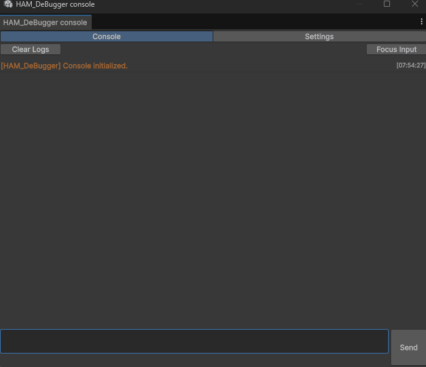
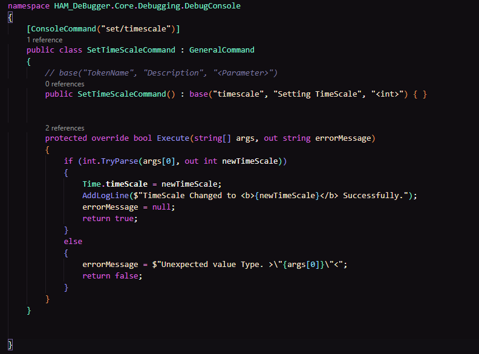
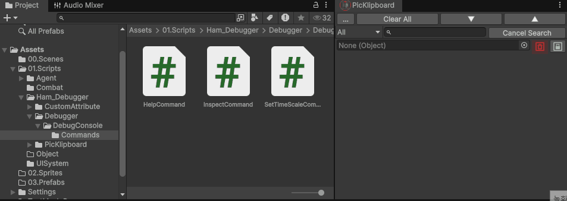

## 📕 개요

| 타이틀 | HAM_Debugger |
| --- | --- |
| 사용 환경 | Unity |

| 깃허브 | 🔗[HAM_Debugger Git](https://github.com/vcsHB/HAM_Debugger) |
| --- | --- |
| 개발 인원 | 1인 개발 |

<h2>💻 주요 기능 개발 리스트</h2>

<button class="review-item-btn" onclick="toggleReview(event, 'cmdEditor')">
1. CMD Console Window - Cmd 기반 에디터▼
</button>
<button class="review-item-btn" onclick="toggleReview(event, 'objectClipboard')">
2. PiklipBoard - 오브젝트 클립보드 에디터 ▼
</button>

🪟 CMD Console Window 기반 에디터

Unity에 CMD console을 접목시켜 지정된 명령어를 입력하면 특정 작업을 수행하도록 확장 가능한 디버깅 툴입니다.

특정 클래스를 상속, Attribute만을 통해 자유로운 명령어 확장이 가능하며
 

직접 Command Parser를 구현하여 토큰으로 분할된 명령어들이 의도에 맞도록 제 기능을 할 수 있도록 구조를 개발했습니다.

📋 PiklipBoard - 오브젝트 클립보드 에디터

오브젝트 및 각종 파일들을 Reference로 담아둘 수 있는 '클립보드' 입니다.
기본적으로 프로젝트창에 있는 에셋의 레퍼런스를 저장하여 EditorPrefs에 저장합니다.

🔗[UnityAsset-ObjectClipboard](https://assetstore.unity.com/packages/tools/utilities/object-clipboard-126425?srsltid=AfmBOoo8YqxahgUuWGrKVtedOaTRhmk54lY10LOsYYTbLeK8zvk9NxAN) 에서 영감을 받아 제작하게 되었습니다.
검색, 카테고리 필터 등의 기능들이 추가되어있습니다.

