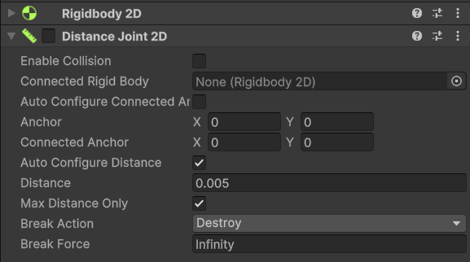
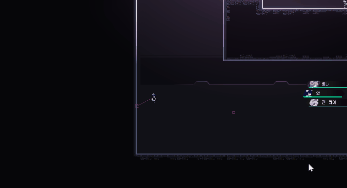
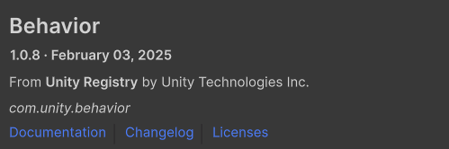
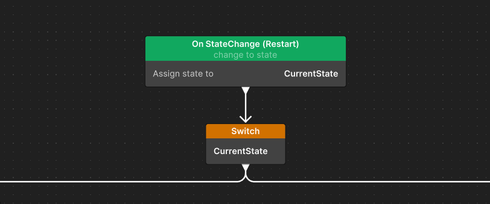
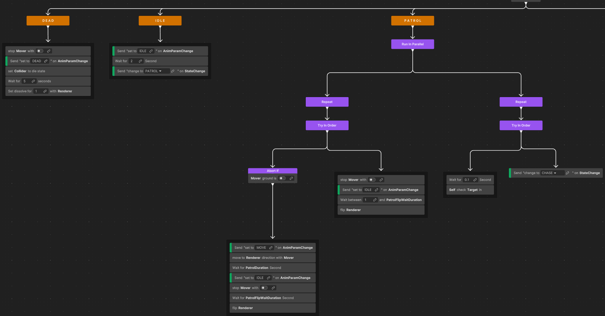
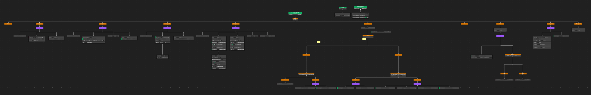

## 📕 개요

| 제목 | NightCode |
| --- | --- |
| 장르 | 3D / 실시간 / 턴제  / 퍼즐 |
| 플랫폼 | Windows |
| 다운로드 | 🔗[구글 드라이브](https://store.onstove.com/en/games/4039) |

| 깃허브 | 🔗[NightCode Git](https://github.com/vcsHB/AVOID) |
| --- | --- |
| 개발 환경 | Unity / C# |
| 개발 인원 | 4인 팀 |
| 역할 | 개발 / 아트 |

<h2>💻 주요 기능 개발 리스트</h2>

<button class="review-item-btn" onclick="toggleReview(event, 'playerManage')">
1. PlayerManage - 플레이어 관리 시스템▼
</button>
<button class="review-item-btn" onclick="toggleReview(event, 'ropeAction')">
2. ROPE ACTION - 조작감을 살린 로프액션 ▼
</button>
<button class="review-item-btn" onclick="toggleReview(event, 'enemyAI')">
3. COMBAT: Enemy AI - 전투와 적 AI 구현 ▼
</button>

📑 PlayerManage - 플레이어 관리 시스템 

NightCode는 플레이어 캐릭터들을 전환하고 **각각의 캐릭터들이 모두 다른 공격방식**을 구사합니다. 이것을 위한 캐릭터 전환 시스템을 구축하고 플레이어의 편성 정보, 플레이어의 상태에 따른 태그 예외처리 등등이 구현되어있습니다.

[🔗 깃허브 PlayerManager.cs](https://github.com/vcsHB/NightCode/blob/main/Assets/01.Scripts/Combat/PlayerTagSystem/PlayerManager.cs) 

Player들을 Manager내에서 관리해줍니다. 하지만 기능이 많이 확장되면서 객체를 분리할 필요성을 느꼈습니다. 그래서 현재 여러 공모전 준비 과정중에 이에 대한 부분을 **리팩토링 중**에 있습니다. 

이전에 미리 [IPlayerSubManager.cs](https://github.com/vcsHB/NightCode/blob/main/Assets/01.Scripts/Combat/PlayerTagSystem/IPlayerSubManager.cs) 를 통해 **하위 매니저 기능**을 만들어두었기 때문에. 이를 활용한 확장으로 캐릭터 관리에 대한 책임을 CharacterSelectorManager와 같은 객체를 만들어 넘길 계획중에 있습니다.

🪢 ROPE ACTION - 조작감을 살린 로프액션

유니티 2D 자체에 들어있는 Distance Joint 2D를 활용하여 로프와 같은 움직임을 구현하였습니다.

Joint의 몇가지 옵션들을 설정하여 가장 로프같으면서도 조작감을 해치지 않도록 설정했습니다.
그리고 코드 내부적인 연산을 통해 좀더 자연스럽고 액션감과 속도감을 보여 줄 수 있도록 물리 연산을 진행하였습니다. 

🔗[개발일지 - 로프액션](https://dev-vcs.tistory.com/entry/%EC%A1%B8%EC%97%85%EC%9E%91%ED%92%88-%EA%B0%9C%EB%B0%9C-%EA%B8%B0%EB%A1%9D-%EB%A1%9C%ED%94%84-%EC%8A%A4%EC%9C%99%EA%B3%BC-%EB%B2%A1%ED%84%B0-%EB%82%B4%EC%A0%81)

🤖 COMBAT: Enemy AI - 전투와 적 AI 구현

<h2>👩‍🦲 일반 Enemy AI : Patrol, Idle 등등 구현</h2>

전투와 적 AI를 개발했습니다.  🔗[깃허브 Enemy BT](https://github.com/vcsHB/MaidInDDUCKING/tree/main/Assets/01.Scripts/Agent/Enemy/BT)

적들이 가지는 복잡한 행동 방식과 순서를 조건에 따라 분기하고 우선순위를 더욱 가시적이고 유연하게 확장하기 쉽도록 제작할 수 있는 Behavior Tree를 사용하여 적의 AI를 개발했습니다.

이때, BT는 Unity 6 최신 버전에서 공식적으로 지원하는 Behavior Graph를 활용하였습니다.

학교에서 수업시간에 배운 부분과 개인적으로 문서를 찾아보고 연구하여 제작하였습니다.

전투방식이 기획 과정에서 많이 바뀌어 지금은 폐기된 시스템이지만. 기존에 게임에는 적에게 콤보를 가하고 기절수치를 올려 적을 강제로 기절시키고 추가 피해를 입도록 하는 시스템이 존재했습니다. FSM이었다면 StateMachine을 통한 ChangeState()로 쉽게 언제든지 스테이트를 전환 할 수 있지만, BT는 노드의 성공여부나 조건에 따라 다음 노드로 넘어가거나 이전 노드로 돌아가는 등, 스테이트 간의 자유로운 이동이 제한적입니다. 

따라서 이에 대한 첫 번째 문제에 부딫힙니다. 이에 대한 해결을 위해 FSM과 BT를 섞어 사용해야했습니다.

이를 위해 이벤트 채널을 활용하였습니다. EventChannelBase를 상속받아 구현된 StateChnage클래스를 만들고 이벤트가 발행되었을때 하위 트리 전체를 몽땅 재시작하게끔 구성하면, FSM과 같이 언제든지 원할 때에 스테이트를 탈출 가능한 BT가 완성됩니다.

<h2> 💻 1챕터 보스 개발에 BT 활용 </h2>

1챕터 보스 “BurnOut”은 총 5가지의 행동을 취하고 각각의 행동이 조건에 따라 복잡하게 흘러가므로 이러한 개발에 적절한 Behaviour Tree를 활용하였습니다.

각각의 패턴을 구사하기 위해 미리 필요한 요소들을 객체화시키고 기능을 분할시켜 블랙보드에 등록시켰습니다. 예로는 레이저 발사를 담당하는 객체. 보스의 움직임을 담당하는 객체. 애니메이션과 추가적인 비주얼을 관리하는 렌더러가 있습니다.

